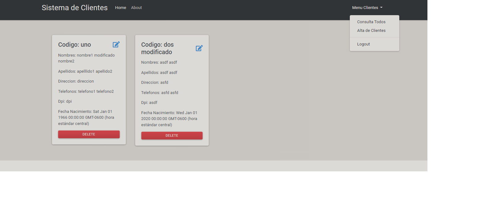

# Sistema de Clientes usando NodeMongo

Esta es una aplicacion sencilla para llevar el alta de clientes.

Esta app puede hacer:

- CRUD Operaciones: crear/Read/Update/Delete Clientes
- Permite que el usuario accese a travez de un login y 
guarde su configuracion personal. Ademas tiene accesos por usuario
y permite asignar Tokes por sesion. El administrador puede cambiar
el tiempo de expiracion del Token.

# Screenshot



# Environment Variables

Esta app necesita de las siguientes variables de entorno:

- `MONGODB_HOST` this is the Mongodb URI string
- `MONGODB_DATABASE` Mongodb database name
- `NODE_ENV` node environment

** Es necesario tener instalado y configurado MONGODB de forma local

# Docker

you can run a container for development

```shell
npm install
docker-compose up
```

## Default User

Cuando se corre por primera vez la aplicacion se crea el usuario Admin 
con las siguientes credenciales (las claves estan encriptadas):

- email: admin@localhost
- password: adminpassword

"# ciso2020" 
"# appClientes" 
"# appClientes" 
